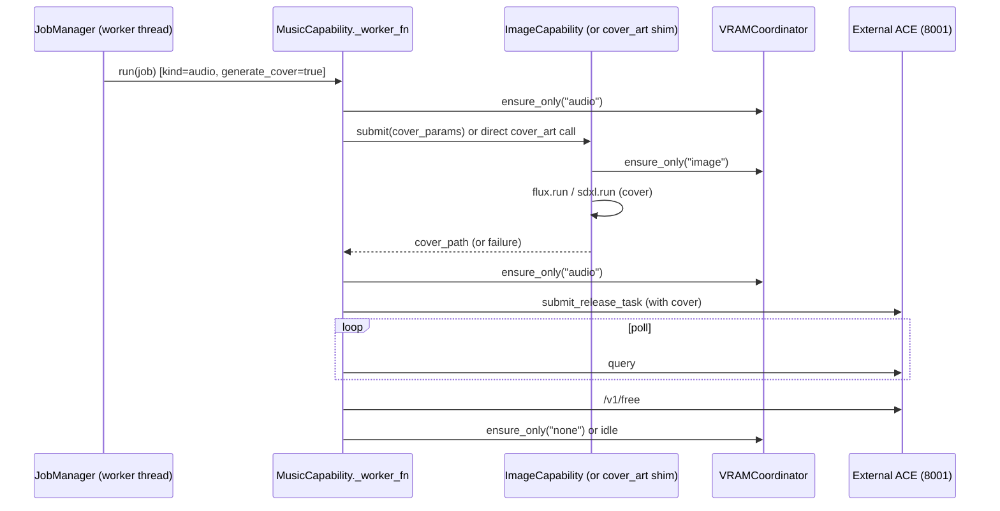

# Kraken Art: Unified Capability Registry & MCP Agent Control Surface Architecture

**Author:** Grok (Build subagent, systems architect review)
**Date:** 2026-05-27
**Branch:** feature/audio-integration (post full 2026-05-27 source + docs audit)
**Status:** Draft

**Related artifacts (mandatory references for implementers):**
- `F:\Kraken Art\Documentation\TODO.md` (pole-star definition + task #21 MCP)
- `F:\Kraken Art\Documentation\Cursor-audio-adaption.md` (complete "no surprises" history of audio port, Phases A–D, dependency isolation contract)
- `F:\Kraken Art\Documentation\BUGS.md` (B-011 through B-015 recorded in the 2026-05-27 audit)
- `F:\Kraken Art\Documentation\ARCHITECTURE.md`
- `F:\Kraken Art\Documentation\PIPELINES.md`
- `F:\Kraken Art\Documentation\CHANGELOG.md` (detailed Phase B–D audio entries)
- Backup snapshot: `F:\Kraken Art\backups\2026-05-27-1544-full-source-backup\`

---

## Overview

Kraken Art is a local-only Tauri 2 + React + Python FastAPI desktop workstation (sidecar on 127.0.0.1:7780) intended as a robust, unified replacement for ComfyUI. It already delivers mature image generation (SDXL all-in-one via `pipelines/sdxl.py`; FLUX1 components with custom `StreamingLinear` offload in `pipelines/flux.py` + `streaming_linear.py`), ESRGAN upscaling, Civitai integration, a single-FIFO `JobManager` (`python/jobs.py`) for VRAM predictability, and a hardened Rust sidecar watchdog (`src-tauri/src/lib.rs`).

On the active `feature/audio-integration` branch, audio was pragmatically ported from the mature sister project `F:\Kraken_Audio` (ACE-Step engine on 8001 + Codex Song Studio workstation on 8010). This delivered a Suno-style Music tab (`src/Music.tsx`), cover-art redirection through Kraken's own FLUX/SDXL pipelines (Phase C, via new `python/api/cover_art.py`), and MP3 export with ffmpeg + mutagen ID3+APIC (Phase D, via `python/pipelines/audio/mp3_export.py` + `python/api/audio.py`).

The result of rapid accretion is "chaos barely contained": duplicated concerns (health probes, model discovery, VRAM release, error surfaces, progress events, cancel handling) between the image path (`python/api/generate.py` + pipelines) and audio proxies (`python/api/audio.py`, `python/pipelines/audio/orchestrator.py`, `ace_client.py`, `song_studio_client.py`). There is no unified abstraction for "what this workstation can do." The MCP server (the ultimate North Star per TODO.md task #21) remains a TODO.

This design delivers a concrete, implementable architecture that transforms the current state into a **smooth, coherent, extensible ecosystem/platform** while preserving every line of working image and audio code. The centerpiece is a **Capability / Modality Registry** that both the manual GUI and future first-class MCP agent surface consume. New modalities (SFX, voice cloning, video engines, 3D, etc.) become pluggable with minimal friction. All generation paths share consistent lifecycle, progress, cancel, error, and VRAM abstractions. Manual human use and AI-orchestrated multi-step workflows ("make art and a full song with cover + timed lyrics + rendered video") coexist as first-class peers.

---

## Background & Motivation

User's exact vision (this session):
> "I think you have the general idea of what I am trying to do here right? a one stop shop for everything art, sound effects, music with the ability to be a.i. controlled whereby I can ask you, for example, please go make art and music and you'd be able to use the app to do that. Or I, of course, could do it manually. I've made great progress on this app so far but it feels to me like chaos barely contained. Instead of a smooth ecosystem."

Core North Star (TODO.md lines 5–6 and task #21):
> "a robust, public-release ComfyUI replacement that runs on a variety of user systems" + "The whole point of the original architecture decision — a local AI agent should drive Kraken Art end-to-end."

The 2026-05-27 full source + docs audit (recorded in BUGS.md header and Cursor-audio-adaption.md §16) surfaced five new open bugs (B-011–B-015) that are direct symptoms of the accretion pattern:

- **B-011** (`python/pipelines/audio/orchestrator.py:69`): `_generate_cover` hardcodes `arch="flux1"` and calls `flux.run` directly. Ignores `config_store.lastGenerate` (the mechanism painstakingly added to `python/api/cover_art.py:139` and `_user_default_from_settings`). No SDXL fallback for users whose primary working pipeline is SDXL.
- **B-012** (`python/api/audio.py:438`): MP3 download re-globs by sanitized title (`f"{title}*.mp3"`) + mtime instead of using the exact `mp3_path` returned by `export_song` (which already does uniqueness via `_safe_filename` + workspace grouping in `mp3_export.py:314`).
- **B-013** (same class as B-003): Cancel during the cover-generation phase of a music job is a no-op until the ACE submit. The `while job.cancel.is_set()` guard (`orchestrator.py:172`) is post-submit only. `_generate_cover` uses a `_CoverJobShim` that never polls the parent cancel Event during the synchronous `flux.run`/`sdxl.run` call.
- **B-014**: `ffmpeg` (core to the shipped MP3 feature) is only probed deep in `mp3_export.py:118` (`_ensure_ffmpeg` + `shutil.which`). No surface in `audio_health`, `song_studio_health`, or Settings.
- **B-015**: Audio proxies (`audio.py:128`, `285`, `303`) use hard-coded 120s/300s timeouts and `iter_bytes()` (full buffering in some paths). No Range header forwarding, no length limits.

Additional systemic issues (grounded in the audit of `Cursor-audio-adaption.md` Phases A–D, `ARCHITECTURE.md`, `jobs.py`, and side-by-side comparison of `generate.py` vs `audio.py` + `orchestrator.py`):

- Duplicated health / model surfaces (`/api/audio/health`, `/api/audio/song-studio/health`, `/api/audio/models` vs core `/api/gpu` + `/api/models` with its special `_scan_audio_external` path in `api/models.py:40`).
- Inconsistent VRAM discipline (image pipelines do aggressive cross-arch `unload()` at `flux.py:1145`; audio relies on post-job `ace_client.free_memory()` calls).
- Progress events are ad-hoc (`"image"`, `"audio_progress"`, `"audio_cover_progress"`, `"ace_submitted"`, `"bulk_song_done"`). No uniform schema.
- Cancel is only reliable mid-sampling (B-003); model-load and cover phases are blind spots.
- No single discoverable surface for an MCP client to enumerate "I can generate images with these exact schemas, music with these external dependencies, and compose full songs."

The audio port itself is valuable and must not be thrown away: it correctly respects the transformers conflict (ACE-Step pins `<4.58`, Stable Audio 3 wants `>=5.8`; see Cursor-audio-adaption.md §69–72 and the "dependency-metadata" override warning), reuses the finished ACE + Song Studio product over HTTP, redirects cover art per user contract, and delivers the full Suno-style library + persistent player experience in `src/Music.tsx` (Phases B1–B3).

The design must deliver a **smooth ecosystem** that makes both direct human use and agent-driven multi-modal work delightful and reliable.

---

## Goals & Non-Goals

### Goals (in priority order)
1. **Unified Capability / Modality Registry** (`python/platform/registry.py` + adapters) that both React GUI (tabs, dropdowns, forms) and the future MCP server consume. New modalities are pluggable by implementing a small adapter interface and registering at sidecar startup.
2. **Consistent abstractions** across all paths for:
   - Job lifecycle (extend `python/jobs.py` singleton)
   - Progress / status events (standard + modality-specific payload)
   - Cancel (reliable points including cover phase and model load where feasible)
   - VRAM management (central coordinator with registered unload hooks)
   - Error surfaces and health
3. **First-class, production-grade MCP server surface** (stdio primary for Claude Desktop / LM Studio / Grok / Cherry Studio; optional localhost SSE) so agents can:
   - Discover tools via registry-derived schemas
   - Invoke long-running multi-step workflows
   - Receive progress / errors reliably
   - React to completion (e.g., chain image → music → lyric timing → video render)
4. **Clean layer boundaries**:
   - **Platform services**: JobManager, VRAMCoordinator, ModelScanner (generalized), OutputLibrary, ConfigStore, Registry.
   - **Modality engines**: thin adapters over existing image pipelines + audio proxies (no rewrite of ACE logic).
   - **Presentation**: React components (static tabs OK initially) + auto-generated MCP tool definitions.
5. **Incremental, zero-throwaway migration** from today's `feature/audio-integration` code. Every PR leaves audio and image fully functional.
6. **GUI + Agent parity**: The same registry, jobs, WS, and cancel semantics serve both. No special-casing that makes one path second-class.

### Non-Goals (explicit boundaries)
- In-process import of ACE-Step / Stable Audio / LuxTTS code (violates the documented isolation contract in Cursor-audio-adaption.md).
- Full third-party plugin/extension system (stretch goal in TODO.md; registry is internal-only for v1–v2).
- Video, 3D, or SFX implementation (only the registration hooks and example adapter skeleton).
- Cloud fallback or remote execution.
- Immediate deprecation of existing `/api/generate`, `/api/audio/*` endpoints (long compat window required).
- Dynamic React form generation from JSON Schema in the first two PRs (keep hand-crafted polished forms; schema drives MCP + future UI).

---

## Proposed Design

### High-Level Target Architecture

```mermaid
graph TD
    subgraph "Tauri Host (src-tauri/src/lib.rs)"
        GUI[React GUI<br/>src/App.tsx + Music.tsx + Generate.tsx]
        MCP_Bridge[Optional MCP Bridge Launcher]
    end

    subgraph "Python Sidecar (python/main.py:105-116)"
        Registry[Capability Registry<br/>python/platform/registry.py]
        JobManager[JobManager (enhanced)<br/>python/jobs.py]
        VRAM[VRAMCoordinator<br/>python/platform/vram.py]
        ModelScan[Generalized Model Scanner]
        CoverSvc[Cover Service<br/>(refactored cover_art.py)]

        subgraph "Modality Adapters (python/platform/capabilities/)"
            ImageCap[ImageCapability]
            MusicCap[MusicCapability]
            FutureCap[Video/SFX/Voice Adapters]
        end

        ImagePipelines[pipelines/flux.py + sdxl.py<br/>+ upscale_esrgan.py]
        AudioProxies[pipelines/audio/<br/>orchestrator.py (refactored)<br/>ace_client.py + song_studio_client.py + mp3_export.py]
    end

    subgraph "External (unchanged, respected isolation)"
        ACE[ACE-Step :8001]
        SongStudio[Codex Song Studio :8010]
    end

    GUI -->|fetch /ws| SidecarAPI[/api/* + /ws/jobs/* + /api/capabilities]
    SidecarAPI --> Registry
    Registry --> ImageCap & MusicCap
    ImageCap --> ImagePipelines
    MusicCap -->|cover| ImageCap
    MusicCap --> AudioProxies --> ACE & SongStudio

    MCP_Client["MCP Client<br/>(Claude Desktop, Grok, etc.)"] -->|stdio or SSE| MCPServer[python/mcp/server.py<br/>(registry-derived tools)]
    MCPServer --> Registry
    MCPServer --> JobManager

    JobManager -->|FIFO worker| ImageCap & MusicCap
    VRAM -. registered unloads .-> ImageCap & MusicCap
```

**Current (pre-design) state for contrast** (the "chaos" the user described):

```mermaid
graph TD
    GUI -->|/api/generate| GenAPI[python/api/generate.py]
    GUI -->|/api/audio/generate| AudioAPI[python/api/audio.py]
    GenAPI --> JobManager --> flux.run / sdxl.run
    AudioAPI --> JobManager --> orchestrator.run
    orchestrator.run -->|hardcoded flux1 + _CoverJobShim| flux.run
    orchestrator.run --> ACE
    AudioAPI -->|thin proxies| ACE & SongStudio
    No single discovery surface
```

### Capability / Modality Registry (Core Abstraction)

New directory: `python/platform/`

**`python/platform/capability.py`** (interface — tightened per review)

```python
from __future__ import annotations
from abc import ABC, abstractmethod
from typing import Any
from jobs import Job, manager as job_manager

class Capability(ABC):
    """Base contract for all modalities. Implementations live in platform/capabilities/."""

    # Class-level constants (preferred over bare attributes for clarity and mypy)
    ID: str = "override-me"
    NAME: str = "Override Me"
    DESCRIPTION: str = ""
    JOB_KIND: str = "image"          # "image" | "audio" | "mp3_export" | ...
    INPUT_SCHEMA: dict[str, Any]     # JSON Schema or Pydantic model_json_schema()
    OUTPUT_SCHEMA: dict[str, Any] | None = None
    UI_HINTS: dict[str, Any] = {}
    OPS: list[str] = ["generate"]    # e.g. ["generate", "export_mp3", "compose"]

    @property
    def id(self) -> str: return self.ID
    @property
    def name(self) -> str: return self.NAME
    # ... (similar for others; or use __init__ for instance data if needed)

    # Lifecycle
    @abstractmethod
    def health(self) -> dict[str, Any]:
        """Return current health. Implementations must be cheap or rely on registry caching (see Issue 2)."""
        ...

    def submit(self, params: dict[str, Any]) -> Job:
        """Submit via central JobManager (FIFO + single worker thread)."""
        return job_manager.submit(self.JOB_KIND, params, self._worker_fn)

    @abstractmethod
    def _worker_fn(self, job: Job) -> dict[str, Any]:
        """Executed on the JobManager worker thread. Must be thread-safe.
        May block (model load + inference). Must poll job.cancel.is_set() at safe points.
        Must emit standardized events via job.emit (see platform/events.py).
        """
        ...

    # Optional high-level ops (used by composers and MCP tool generation)
    def supports(self, op: str) -> bool:
        return op in self.OPS

    # Optional explicit cancel hook (beyond the job.cancel Event)
    def cancel(self, job: Job) -> bool:
        job.cancel.set()
        return True
```

**Progress event taxonomy contract** (documented in `platform/events.py`):
- Canonical keys always present: `type`, `status|progress|message`.
- Namespaced extensions allowed and encouraged: `"audio_cover_progress"`, `"ace_submitted"`.
- Adapters **must** continue emitting the exact legacy event shapes used by `src/Music.tsx` (see Issue 6).

**Minimal complete ImageCapability sketch** (illustrative; full version in PR 2):

```python
class ImageCapability(Capability):
    ID = "image"
    NAME = "Image Generation (SDXL / FLUX1)"
    JOB_KIND = "image"
    INPUT_SCHEMA = GenerateRequest.model_json_schema()  # from api/generate.py
    OPS = ["generate", "upscale"]

    def _worker_fn(self, job: Job) -> dict:
        VRAMCoordinator.ensure_only("image")
        if job.params["arch"] == "flux1":
            return flux.run(job)   # existing, now under adapter
        ...
```

The `Job` dataclass (`jobs.py:34`) receives the documented additive fields (`capability_id`, `parent_job_id`) with a one-time migration note for any persisted snapshots (none exist today; in-memory only).

**`python/platform/registry.py`**

```python
from typing import Dict
from .capability import Capability

class CapabilityRegistry:
    _instance: "CapabilityRegistry | None" = None
    _caps: Dict[str, Capability] = {}

    @classmethod
    def instance(cls) -> "CapabilityRegistry":
        if cls._instance is None:
            cls._instance = cls()
        return cls._instance

    def register(self, cap: Capability) -> None:
        if cap.id in self._caps:
            raise ValueError(f"Duplicate capability id: {cap.id}")
        self._caps[cap.id] = cap

    def get(self, cap_id: str) -> Capability:
        return self._caps[cap_id]

    def list(self) -> list[dict]:
        return [
            {
                "id": c.id,
                "name": c.name,
                "description": c.description,
                "job_kind": c.job_kind,
                "input_schema": c.input_schema,
                "ops": getattr(c, "ops", ["generate"]),
                "ui_hints": c.ui_hints,
                "health": c.health(),
            }
            for c in self._caps.values()
        ]
```

Registration happens once in `python/main.py` after all routers (or via a `platform/bootstrap.py`):

```python
from platform.registry import CapabilityRegistry
from platform.capabilities.image import ImageCapability
from platform.capabilities.music import MusicCapability

reg = CapabilityRegistry.instance()
reg.register(ImageCapability())
reg.register(MusicCapability())
```

New endpoint (additive): `GET /api/capabilities` → returns `reg.list()` (consumed by GUI for future dynamic surfaces and by MCP for tool discovery).

**Health caching strategy in `registry.list()` (addresses major review feedback)**:
`c.health()` calls (which perform real I/O to ACE `/health` and Song Studio `/api/config`) are **not** invoked on every list call. Instead:
- Registry maintains an in-memory `_health_cache: dict[str, (timestamp, result)]`.
- Default TTL = 8 seconds (tunable via `KRAKEN_CAP_HEALTH_TTL`).
- `list()` (and the `?light=true` variant used by MCP bootstrap) returns cached values when fresh.
- A background thread (started in `bootstrap.py`) refreshes all capabilities' health every TTL/2 when the sidecar is idle.
- Heavy probes can be forced via `POST /api/capabilities/refresh` (used by "Check ACE service" button).
- MCP stdio bootstrap uses `?light=true` (cached + cheap fields only) to avoid blocking agent startup on slow external services.

This prevents health timeouts from blocking `/api/capabilities` or MCP discovery while still providing fresh status for the Music tab health indicators.

### Standardized Job Events & Lifecycle

Extend `python/jobs.py`:

- Add `modality: str` (or `capability_id`) to `Job`.
- Define canonical event types in `platform/events.py`:
  - `{"type": "status", "status": "...", "message": "..."}`
  - `{"type": "progress", "step": N, "total": M, "message": "..."}`
  - `{"type": "preview", "b64": "..."}`
  - Modality-specific: `{"type": "audio_cover_progress", ...}`, `{"type": "ace_submitted", ...}`, `{"type": "mp3_export_progress", ...}`
- `Job.emit` remains the single path; WS subscribers (`api/progress.py`) are unchanged.
- **Backward compatibility contract (critical for src/Music.tsx)**: In PR 3 (MusicCapability), adapters **must** continue emitting the exact legacy event shapes currently used by the Music tab and sidecar.ts (`"audio_progress"`, `"audio_cover_progress"`, `"ace_submitted"`, `"audio_complete"`, `"bulk_song_done"`, `"bulk_song_failed"`, etc. — verified in orchestrator.py:93,193,164,236 and audio.py bulk worker). A small compatibility helper in `platform/events.py` (`emit_legacy_and_standard(...)`) is provided and required. Only after one full release of dual emission may the legacy keys be considered for removal (see Open Questions table). Rollout verification explicitly includes: "Music tab player bar, cover progress banners, bulk export status, and inline players continue to function with zero changes to src/Music.tsx or src/api/sidecar.ts".

### VRAM Coordinator

New `python/platform/vram.py`:

```python
class VRAMCoordinator:
    _unloaders: dict[str, Callable[[], dict]] = {}

    @classmethod
    def register_unloader(cls, kind: str, fn: Callable[[], dict]) -> None:
        cls._unloaders[kind] = fn

    @classmethod
    def ensure_only(cls, target_kind: str) -> None:
        for k, fn in list(cls._unloaders.items()):
            if k != target_kind:
                try:
                    fn()
                except Exception:
                    pass
        # plus torch.cuda.empty_cache() + gc
```

Image pipelines register their `unload` fns at import time (in `flux.py` and `sdxl.py` module level after the pipeline functions are defined). Music adapter registers its ACE free hook in `music.py` (and the thin ACE client).

**Registration timing contract (in `python/platform/bootstrap.py`)**: All core capabilities are registered **after** the pipelines are imported but **before** the FastAPI routers are mounted and uvicorn starts. This guarantees that `registry.list()` and VRAMCoordinator are fully populated by the time the first `/health` or `/api/capabilities` call can arrive. Adapters call `VRAMCoordinator.register_unloader(...)` in their `__init__` or module-level code.

**Precise VRAM handoff sequence for composite jobs** (e.g., music + internal cover — the exact case that produced B-013 and VRAM thrashing risk):



**Pseudocode inside MusicCapability (excerpt)**:

```python
def _worker_fn(self, job: Job) -> dict:
    p = job.params
    if p.get("generate_cover"):
        if job.cancel.is_set(): return {"cancelled": True}
        VRAMCoordinator.ensure_only("image")
        cover = self._generate_cover_via_image_cap(job, p)  # or cover_art endpoint
        if job.cancel.is_set(): ...  # best-effort cleanup
        VRAMCoordinator.ensure_only("audio")  # handoff before heavy ACE work
    ...
    ace_task = client.submit(...)
    ...
    client.free_memory()
```

This sequence eliminates the race the reviewer correctly flagged (direct `flux.run` inside audio worker without explicit VRAM coordination). The existing comment in `orchestrator.py:103-105` is replaced by the above contract.

This replaces the ad-hoc `sdxl_mod.unload()` calls at the top of `flux.py:1145` and scattered `free_memory` calls.

### Music Capability Refactoring (Fixes B-011, B-013)

`python/platform/capabilities/music.py` (new) owns the current logic from `orchestrator.py` + `audio.py` generate path.

- `_generate_cover` becomes a call into `ImageCapability` (or the existing `cover_art` service during transition) **using the same priority as `cover_art.py:358`** (explicit > `lastGenerate` via `config_store` > auto-defaults). This directly fixes B-011.
- VRAM handoff + cancel explicitly follow the sequence and pseudocode in the VRAM Coordinator section above (addresses the race condition in the old direct `flux.run` path inside the audio worker).
- Cancel guard moved before cover generation + inside the cover shim (poll `job.cancel` between steps where possible; on cancel during cover, still do best-effort ACE free if partial state exists). Fixes B-013.
- All progress events standardized.
- The thin `orchestrator.py` can delegate to the capability (or be kept as a thin wrapper for one release).

The existing `python/api/audio.py` endpoints remain (they call the capability under the hood). Song Studio external callers continue to use the synchronous `POST /api/cover-art` (unchanged contract).

### Hardening the Audio Proxies (Fixes B-012, B-014, B-015)

In `python/api/audio.py` and `mp3_export.py`:

- `download_exported_mp3` (and bulk equivalent) must persist and return the exact `mp3_path` / `mp3_url` from the successful export result instead of re-globbing. The bulk worker already captures `mp3_path` in the job result (line 503); the download handler must use it (or a sidecar index) rather than `glob + mtime`. Fixes B-012.
- Add `ffmpeg` probe to `song_studio_health` (and a new top-level audio capability health) using the existing `_ensure_ffmpeg` logic. Surface `{mp3_export: {available: bool, path: str|None, bitrate: "V0"}}`. Fixes B-014. Frontend can show a clear badge in the Music tab.
- Streaming endpoints (`/file`, `/stream`, exported downloads): switch to true `httpx` streaming with `Range` header passthrough, `Content-Length` when known, and per-request timeout override (default 300s for long songs, configurable via query or settings). Add soft size guard + early 413 for absurdly large assets. Fixes B-015. Keep the "good enough for v1" note but make it production-grade.

### MCP Server Surface (Task #21)

New `python/mcp/` package (optional dependency group or pure stdlib + httpx where needed).

Primary transport: **stdio** (the MCP spec default for desktop tools). Agents spawn `python -m kraken.mcp.stdio` (or a thin launcher script). The server reads JSON-RPC from stdin, writes to stdout.

Secondary (for in-app "Agent activity" feed per TODO task #22): localhost SSE at `/mcp` (or a dedicated MCP port) protected by a simple capability token or same-process check.

`python/mcp/tools.py` (or generated):

- Discovery tools (auto from registry): `list_capabilities`, `get_capability_schema(cap_id)`
- Core: `submit_job`, `get_job`, `cancel_job`, `list_recent_outputs`, `refresh_models`, `get_gpu_status`, `free_vram`
- Modality high-level (composers that demonstrate the vision):
  - `generate_image(params)`
  - `generate_music(params)` (includes optional cover via internal image cap)
  - `export_song_mp3(song_id, ...)`
  - `compose_full_song(prompt, lyrics?, style?, duration?, with_cover=True, with_video=False)` — the canonical multi-step example. Internally submits image job (if cover), music job, optionally chains to future lyric-timing + video render capability. Returns a parent job id with child job references in the result.
- Progress: MCP supports notifications; the server can push `job_progress` events.

The MCP server imports the exact same `CapabilityRegistry` and `JobManager` as the sidecar — zero duplication.

Tauri can optionally expose a command to launch a local MCP stdio bridge for "embedded agent" use inside the desktop window.

Example Claude Desktop config (shipped in docs):

```json
{
  "mcpServers": {
    "kraken-art": {
      "command": "python",
      "args": ["-m", "kraken.mcp.stdio"],
      "env": { "KRAKEN_SIDECAR_URL": "http://127.0.0.1:7780" }
    }
  }
}
```

### MCP Protocol & Tool Surface (Detailed Specification)

This subsection provides the concrete implementation guidance requested for the headline MCP deliverable (TODO.md task #21). It resolves Open Question #1 (stdio-only recommended for v1 — see table) and is the binding spec for **PR 4** (MCP Server Surface).

#### 1. Bootstrap & Connection Sequence (stdio primary)
The MCP server process (`python -m kraken.mcp.stdio` or thin `kraken-mcp-launcher.py` wrapper):
1. Reads `KRAKEN_SIDECAR_URL` (default `http://127.0.0.1:7780`) and optional `KRAKEN_MCP_TOKEN` (for future SSE or hardened local setups; empty for pure stdio/localhost).
2. Performs blocking health poll (up to 30 s, 1 s interval) against `/health` and `GET /api/capabilities?light=true` (see Issue 2 caching).
3. On success, emits `{"type": "ready", "sidecar_url": "...", "capabilities": N}` on stdout and begins JSON-RPC loop.
4. If sidecar unreachable after timeout: emit error + exit 1 (agent host surfaces "Kraken Art sidecar not running").
5. Tauri "embedded agent" mode (optional, PR 4/5): host exposes a command that spawns the stdio server as a child and pipes stdio through a Tauri event channel for in-window agent activity.

No persistent auth token required for stdio on localhost (process is already user-owned). For the optional SSE path (`KRAKEN_MCP_SSE=1`), a simple per-launch UUID token is generated and printed once at startup.

#### 2. MCP Protocol Compliance
- **Transport**: stdio (JSON-RPC 2.0 over stdin/stdout) per official MCP spec. No custom framing.
- **Core methods implemented** (auto-derived from `CapabilityRegistry`):
  - `tools/list` → returns one tool per capability primitive + composer tools. Each tool schema is `registry.get(cap).input_schema` + `ops` + output envelope.
  - `tools/call` with `name` (e.g. "kraken.music.generate_music" or "kraken.composer.compose_full_song") and `arguments`.
- **Progress & long-running jobs**: The server subscribes to the existing `/ws/jobs/{id}` (or polls `GET /api/jobs/{id}` for stdio clients that cannot do WS). It translates events to MCP `progress` / `notification` messages:
  ```json
  {"jsonrpc":"2.0","method":"notifications/progress","params":{"progressToken":"job-abc123","value":42,"message":"ACE: 67% synthesis"}}
  ```
- **Error shapes for long-running work**:
  - Immediate validation errors: standard JSON-RPC error.
  - Job failures: `{"type":"job_failed","job_id":"...","error":"...", "partial_result": {...}}` (see composer semantics below).
  - Cancel: `tools/call` with a special `cancel` param or separate `kraken.jobs.cancel` tool.
- **Resources** (optional v1): `kraken://outputs/recent` and `kraken://capabilities/current` (read-only FS-like views of outputs and the registry).
- **Prompts**: Not used in v1 (future for "generate prompt for album cover given song lyrics").

#### 3. Concrete Tool Schema Example (derived from registry)
A `generate_music` tool (from MusicCapability) would appear roughly as:

```json
{
  "name": "kraken.music.generate_music",
  "description": "Generate music via ACE-Step / Codex (includes optional internal cover art via Kraken image pipelines).",
  "inputSchema": {
    "type": "object",
    "properties": {
      "prompt": {"type": "string"},
      "lyrics": {"type": "string"},
      "generate_cover": {"type": "boolean", "default": true},
      "ace_model": {"type": "string"},
      ...  // full shape from MusicCapability.input_schema
    },
    "required": ["prompt"]
  },
  "outputSchema": {
    "type": "object",
    "properties": {
      "job_id": {"type": "string"},
      "status": {"type": "string"},
      "child_jobs": {"type": "array", "items": {"job_id": "string", "kind": "string", "capability": "string"}}
    }
  }
}
```

Discovery tools (`kraken.capabilities.list`, `kraken.capabilities.schema`) allow agents to introspect without hard-coding.

#### 4. High-Level Composer Semantics (`compose_full_song` etc.)
- **Parent / child job contract**: `compose_full_song` returns a parent `job_id` immediately. Its result contains:
  ```json
  {
    "parent_job_id": "...",
    "child_jobs": [
      {"id": "cover-xxx", "kind": "image", "capability": "image", "status": "succeeded"},
      {"id": "music-yyy", "kind": "audio", "capability": "music", "status": "running"}
    ],
    "final_artifact": {"mp3_path": "...", "cover_path": "..."}
  }
  ```
- **Cascading cancel**: Cancel on parent cancels all in-flight children (JobManager + capability-specific best-effort ACE free).
- **Partial results on failure**: If cover succeeds but music fails, the result includes the successful child artifacts + error on the failed leg. Agents can choose to retry only the failed leg.
- **Progress fan-out**: Every child progress event is forwarded with `child_job_id` context so the MCP client can render a tree.
- Location: Implemented in `python/platform/composer.py` (per resolved Open Question #2). MusicCapability exposes only the primitive `generate_music`; the composer layer coordinates the image leg + music leg + optional future lyric/video steps.

#### 5. Minimal Stdio Server Skeleton (python/mcp/stdio.py)
```python
import sys, json, asyncio
from kraken.platform.registry import CapabilityRegistry
# ... import job manager, ws client, etc.

async def main():
    reg = CapabilityRegistry.instance()
    # bootstrap sequence (health poll + ready emit)
    for line in sys.stdin:
        req = json.loads(line)
        if req["method"] == "tools/list":
            tools = build_tools_from_registry(reg)  # schema derivation
            write_response(req["id"], {"tools": tools})
        elif req["method"] == "tools/call":
            # dispatch to capability.submit or composer
            # subscribe to WS or poll, emit progress notifications
            ...
```

Full implementation (with proper error handling, cancellation, and notification support) lives in the files created by **PR 4**.

#### 6. Tie to PR 4 Entry/Exit Criteria (updated)
- **Entry**: PR 3 complete (MusicCapability + all B bugs closed, Open Questions 1/2/4 resolved).
- **Exit (before merge)**:
  - `python -m kraken.mcp.stdio` starts, discovers capabilities, successfully calls a `generate_music` (with cover) and `compose_full_song` end-to-end from a simple test JSON-RPC client.
  - Chaining contract (parent/child, partial results, cascading cancel) demonstrated and logged.
  - Documentation/MCP.md + Claude Desktop example updated with the bootstrap sequence and example tool schemas above.
  - Agent abuse limits (see Issue 7) active in the MCP server.

This level of detail removes the implementation surprises risk for the headline feature.

### GUI + Agent Coexistence

- Both talk to the same HTTP surface (`/api/capabilities`, `/api/jobs/*`, WS).
- React components (`Music.tsx`, `Generate.tsx`) remain hand-crafted and polished for human use.
- Future enhancement (later PR): forms can be driven or validated from the schema returned by the registry.
- Agent activity feed (TODO task #22) subscribes to the same WS events + MCP notifications and renders them in a dedicated drawer/pane.
- No path is privileged: a human clicking "Generate" in the Music tab and an agent calling the equivalent MCP tool produce identical job records, progress, and outputs.

---

## API / Interface Changes

**Additive only (existing contracts preserved during migration):**

- `GET /api/capabilities` — new, primary discovery surface.
- `POST /api/jobs/submit` (generic) — optional later; current per-kind endpoints delegate internally.
- MCP tools surface (new process) — not an HTTP API change.

**Before/After example (internal, not user-visible):**

Before (orchestrator.py:69):
```python
req = GenerateRequest(arch="flux1", ...)
result = flux.run(shim)
```

After (inside MusicCapability):
```python
img_cap = registry.get("image")
cover_job = img_cap.submit({...})  # or direct call during transition
# ... wait or poll using shared JobManager ...
```

The public `/api/audio/generate` and `/api/generate` payloads are unchanged.

---

## Data Model Changes

- `Job` dataclass (`python/jobs.py`): additive fields `capability_id: str | None`, `parent_job_id: str | None` (for composer workflows), `modality: str` (back-compat alias).
- No DB schema. All persistence is FS (`outputs/`, `config/settings.json` via `config_store.py`) + in-memory job dict.
- `lastGenerate` (already present) is generalized to `capability_profiles` in a later settings iteration (non-breaking).
- Export results already capture exact paths; the fix for B-012 makes download handlers consume them.

Migration strategy: purely additive. Old job snapshots remain valid. No data migration required.

---

## Alternatives Considered

**1. Thin MCP wrapper over today's ad-hoc endpoints (no registry).**
Fastest path to "MCP works."
Trade-offs: Agents still see duplicated surfaces (`/api/audio/*` vs `/api/*`), must hard-code knowledge of cover-art quirks (B-011), cannot reliably discover "does this instance support SFX or only music?" or "what is the exact schema for a full-song composer?" Perpetuates the "chaos barely contained" feeling. Rejected for the North Star.

**2. Full dynamic plugin system (entry points, third-party wheels loaded into the GPU process).**
Maximum future extensibility.
Trade-offs: Massive increase in attack surface and debugging surface inside the single Python process that owns the 24 GB card. Violates the "no surprises" and "finished product reuse" discipline that made the audio port safe. Heavy for a v1 desktop workstation. Deferred to the stretch goal already listed in TODO.md.

**3. Move audio engines into the main venv / sidecar process.**
Simpler RPC surface.
Trade-offs: Directly contradicts the transformers version conflict documented in Cursor-audio-adaption.md §69–72 and the explicit "we talk to the running ACE API over HTTP" decision. Would break either ACE-Step or future Stable Audio 3 paths. Rejected.

**Selected path (registry + thin adapters + stdio MCP):** Balances immediate unification, respect for existing constraints, and the long-term agent vision. Every alternative was evaluated against the concrete files and history in the 2026-05-27 audit.

---

## Security & Privacy Considerations

- **Threat model**: All components run as the local user on localhost. Primary risks are (a) local malicious process hammering the sidecar with heavy jobs or cancels, (b) path traversal in audio proxies (already guarded upstream in ACE/Song Studio), (c) MCP stdio being spawned by a compromised agent host.
- **Mitigations**:
  - Everything binds only 127.0.0.1.
  - Existing CORS is restricted to Tauri origins + localhost dev.
  - MCP stdio has no network listener by default.
  - For SSE MCP variant: simple per-launch token or PID check; document that it must not be exposed.
  - All file paths returned by MCP / API are relative or under documented roots (`outputs/`, model folders). No arbitrary FS access.
  - VRAM / GPU abuse is a denial-of-service within the user's own machine (acceptable for a creative workstation).
- **Data handling**: Generated artifacts stay in `outputs/YYYY-MM-DD/` and `outputs/exports/`. No telemetry, no cloud. Civitai token (when present) is only used for authorized downloads and is masked in `/api/settings`.
- **Audit surface**: New registry and MCP code must be reviewed for injection in param handling and for leaking absolute paths in error messages.

**Agent Abuse / Resource Limits (added per review feedback)**: Once the stdio MCP surface is available (PR 4), any compromised or overly-permissive agent host (Claude Desktop, custom script, future Grok tool use) can submit unbounded heavy image or music jobs, consuming the user's 24 GB VRAM + CPU for extended periods.

Mitigations (implemented in PR 4 MCP server + settings):
- Simple in-memory counters per capability (jobs submitted in last 5 minutes).
- Configurable `max_concurrent_agent_jobs` (default 2) and `agent_job_rate_limit_per_5min` (default 6) stored in `config/settings.json` under a new `agent` section (exposed safely in `/api/settings`).
- MCP `tools/call` for heavy operations checks the counters first; on breach returns a clear JSON-RPC error with "rate limit" + current usage + suggestion to wait or adjust settings.
- UI banner (in the new Agent activity pane + Logs drawer): "Agent activity driving load (N jobs in last 5 min). Click to view / throttle."
- All MCP-initiated jobs are tagged with `source: "mcp"` in the Job record for easy filtering in logs and the activity feed.
- Documentation explicitly states: "MCP is intended for the user's own trusted local agents only. Do not expose the stdio launcher to untrusted processes."

The core JobManager remains a simple FIFO (no complex quotas in v1); limits are enforced at the MCP facade layer. This is sufficient for the local desktop threat model while giving the user visibility and control.

---

## Observability

- **Logging**: All capability health, submit, and worker events go through the existing `kraken.*` loggers + ring buffer (`python/log_buffer.py`). New structured fields: `capability=xxx`, `job_kind=yyy`.
- **Metrics (in-memory, exposed via new `/api/metrics` or on health)**: jobs per capability, avg duration, cancel rate, peak VRAM delta per job, proxy error counts.
- **Progress**: Existing WS (`/ws/jobs/{id}`) remains the single source for both GUI and MCP. MCP server translates to protocol notifications.
- **Alerting (desktop-appropriate)**: Sidecar watchdog already surfaces restarts (`B-004` fixed). New: capability health degradation in the Logs drawer + optional toast. "ffmpeg missing" becomes a first-class health failure (B-014 fix).
- **Agent activity feed** (TODO #22): New React pane that subscribes to the same events + MCP tool-call notifications. Rate-limit identical lines (already planned).

---

## Rollout Plan

Because this is a local desktop app on a feature branch:

- **No traditional feature flags**; use environment variable `KRAKEN_PLATFORM_REGISTRY=1` (default on after PR3) and additive endpoints.
- **Staged via the PR sequence below**. Each PR is independently reviewable/mergeable and leaves the app in a working state (audio generation, cover art, MP3 export, image gen, Library, player bar all continue to function exactly as today).
- **Compat window**: Existing `/api/generate`, `/api/audio/*`, direct pipeline calls inside Song Studio (via `KRAKEN_COVER_URL`) remain supported for at least two releases after the registry lands.
- **Rollback**: `git revert` of the offending PR (or whole feature branch). Because all changes are additive or narrow refactors inside adapters, risk is low.
- **Verification at each stage**: Run the existing `Launch Kraken Art.bat` (which orchestrates 7780 + 8010 + 8001), Refresh Models, Check ACE/Song Studio health, full music generate with cover, MP3 export (single + bulk), image generate, cancel during various phases, and (later) an MCP stdio smoke test against Claude Desktop or a simple JSON-RPC client.
- **Documentation**: Every PR updates CHANGELOG.md with exact commit/tag references (following the discipline in Cursor-audio-adaption.md).

---

## Open Questions (for user / team input before full implementation)

The following questions were identified during design. They are now presented in table form with recommended defaults (to unblock implementation), impacted PRs, decision owner, and target resolution. At least Q1, Q2, and Q4 **must be resolved before PR 3 review** (MusicCapability + bug fixes), as they directly affect the Capability interface, MCP tool surface, and the B-011 cover logic fix.

| # | Question | Recommended Default | Impacted PR(s) | Decision Owner | Target Resolution | Rationale / Notes |
|---|----------|---------------------|----------------|----------------|-------------------|-------------------|
| 1 | MCP primary transport: stdio-only for v1 (safest), or also ship a localhost SSE listener enabled by default? (Affects Tauri launch logic.) | **stdio-only for v1** (launch via `python -m kraken.mcp.stdio` or thin wrapper script). Document SSE as optional future extension behind `KRAKEN_MCP_SSE=1`. | PR 5 (MCP), PR 6 (Tauri bridge) | User + architect | Before PR 3 branch cut | stdio has smallest attack surface and matches MCP spec recommendation for desktop/local tools. Avoids new listening socket in sidecar process. SSE can be added later for in-app "embedded agent" feed without changing the core registry/MCP contract. |
| 2 | High-level composer workflows: Should `compose_full_song` live inside the MusicCapability or in a separate lightweight `python/platform/composer.py` layer? (Preference for discoverability in MCP `tools/list`.) | **Separate `python/platform/composer.py`** (lightweight orchestrator layer that composes across capabilities). Expose as top-level MCP tools (`compose_full_song`) while MusicCapability exposes the primitive `generate_music`. | PR 3 (MusicCapability), PR 5 (MCP tools) | Architect (with user confirmation on workflow semantics) | Before PR 3 review | Keeps MusicCapability focused on its modality contract. Composers are higher-level and can evolve independently (e.g., future video render chaining). Registry `list()` + tools generation remains clean. |
| 3 | Dynamic UI forms: When do we invest in consuming the registry JSON Schema for form generation vs continuing hand-crafted React forms for the "A1111/Forge spirit" polish the user values? (Can be later PR.) | **Later (post-PR 7)**. Keep hand-crafted forms in v1/v2 for polish. Use registry schemas only for MCP tool definitions and validation. | PR 6+ (optional) | User (UX preference) | After PR 7 if desired | Non-goal for initial unification. Hand-crafted forms match existing Generate.tsx / Music.tsx quality and the A1111/Forge spirit emphasized in the North Star. Schema-driven forms are a natural future extension enabled by the registry. |
| 4 | Cover profile: Do we want a dedicated persisted `coverProfile` (separate from `lastGenerate`) exposed in Settings, or is "whatever I last used in the Image tab" the correct mental model? | **"Whatever I last used in the Image tab" (reuse/extend `lastGenerate`)** for the B-011 fix in PR 3. Add a future `coverProfile` key in settings (generalized from lastGenerate) only if user requests explicit per-modality cover settings. | PR 3 (MusicCapability + B-011 fix), PR 6 (Settings UI) | User | Before PR 3 review | Directly unblocks the cover delegation fix (MusicCapability must call ImageCapability or cover_art.py using the same priority as `cover_art.py:358`). Matches the Phase C "use the current default Kraken Art model" contract in Cursor-audio-adaption.md. Avoids new settings surface until proven needed. |
| 5 | Deprecation timeline for the thin `orchestrator.py` and duplicated health/model endpoints after the adapters land? | **One full release (or 60 days of active use) of compat shims**. Thin delegation in orchestrator.py and legacy `/api/audio/models`, `/api/audio/health` (etc.) remain functional and are documented as deprecated in PR 3/7. Full removal in a follow-up "cleanup" PR after PR 7. | PR 3 (adapters + shims), PR 7 (docs + deprecation notices) | Architect | Document in PR 3; removal after PR 7 | Long compat window respects the "no surprises" rule and the valuable audio port history. Existing Song Studio launchers and any custom scripts continue to work. |

**Resolution process**: User to confirm the four recommended defaults above (especially Q1/Q2/Q4) before PR 3 work begins. Record final decisions in a short "2026-05-27 Architecture Sync" note appended to this document and referenced from CHANGELOG.md. Once resolved, the table becomes the binding spec for the impacted PRs.

---

---

## References (updated with review artifacts)

## References

- `F:\Kraken Art\Documentation\TODO.md` (especially "AI Agent interface (MCP)" section and pole-star quote)
- `F:\Kraken Art\Documentation\Cursor-audio-adaption.md` (entire document, especially dependency conflict §69–72, Phase C cover redirect contract, "no surprises" rule)
- `F:\Kraken Art\Documentation\BUGS.md` (B-003, B-011–B-015)
- `F:\Kraken Art\Documentation\ARCHITECTURE.md` (three-process model, Job lifecycle, VRAM discipline)
- `F:\Kraken Art\Documentation\PIPELINES.md` (FLUX streaming details, current arch coverage)
- `F:\Kraken Art\Documentation\CHANGELOG.md` (2026-05-23 Phase B/C/D entries)
- Source citations throughout: `python/jobs.py:87` (submit), `python/pipelines/audio/orchestrator.py:53–116` (_generate_cover + B-011/B-013 site), `python/api/audio.py:416–448` (B-012 download path), `python/api/cover_art.py:139–186` (_user_default_from_settings), `python/api/generate.py:64–82`, `python/pipelines/flux.py:1143–1145`, `src/Music.tsx:114` (audioGenerate), `src-tauri/src/lib.rs:99` (watchdog), `python/main.py:114–115` (router registration), `python/config_store.py:65` + `api/settings.py`, etc.

---

## Key Decisions (with rationale)

1. **Registry lives in the Python sidecar platform layer (not frontend, not Tauri, not a separate process)**
   Rationale: The registry must be the single source of truth for schemas, health, and supported operations. Both the React GUI (via fetch) and any MCP client (Python process) must see identical data. Placing it in the GPU-owning sidecar also lets it coordinate VRAM and JobManager directly. This matches the "three processes, one window" model in ARCHITECTURE.md.

2. **Audio remains thin HTTP proxies to the external finished product (no in-process engines)**
   Rationale: Explicit contract from the audio port (Cursor-audio-adaption.md §3, §129, orchestrator.py docstring lines 1–16). The transformers conflict is real and was solved by isolation; importing the audio code would regress one of the two working music engines. The registry simply owns the *orchestration and capability declaration* for the music modality.

3. **MCP server is a separate optional stdio (or SSE) entrypoint that imports the same registry/JobManager**
   Rationale: Achieves the "first-class MCP/agent control surface" North Star without forcing the GUI to be running. stdio is the MCP-recommended transport for local tools and has the smallest attack surface. Agents (including this Grok instance in future sessions) can drive complex workflows end-to-end. The in-app Agent activity feed reuses the same events.

4. **All long-running work (including cover generation inside music jobs) ultimately flows through the central JobManager**
   Rationale: Delivers the "consistent lifecycle, progress, cancel, VRAM" goal. The existing synchronous `cover_art.py` path is kept only for external Song Studio callers (compat). Music jobs during the transition can use a sub-job or improved shim, but the invariant is "one FIFO worker thread owns the GPU context."

5. **VRAMCoordinator is a separate small service from JobManager**
   Rationale: Allows pre-submit cross-modality unloading and explicit user "Clear VRAM" actions without tying every unload to queue state. Image pipelines already demonstrate the pattern (`flux.run` calls `sdxl.unload`); we just make it pluggable and symmetric for audio.

6. **Bug fixes (B-011–B-015) are implemented inside the new adapters rather than as separate patches**
   Rationale: The registry/adapter boundary is the natural place to enforce the "use lastGenerate", "propagate cancel", "use exact export paths", and "surface ffmpeg health" contracts. Doing the fixes here prevents the old duplication from reappearing.

---

## PR Plan (Ordered, Independently Reviewable / Mergeable)

Each PR targets `feature/audio-integration` (or a short-lived sub-branch), delivers working software, includes tests/docs updates, and updates CHANGELOG.md with exact prior checkpoint tags where relevant. Audio + image functionality is **never broken**. All changes are additive or narrow refactors inside new adapter modules with thin delegation shims for legacy paths.

**PR 1: Platform Core Abstractions (Registry skeleton + standardized events + VRAMCoordinator interface)**
- **Files affected**: New `python/platform/{__init__.py, registry.py, vram.py, events.py, bootstrap.py}`, `python/jobs.py` (additive fields + constants), `python/main.py` (import + call bootstrap), minor updates to `python/api/progress.py` and log formatting.
- **Description**: Pure foundation. No behavior change to existing endpoints or jobs. Adds `/api/capabilities` stub returning empty list. Smoke test: sidecar starts, health still works.
- **Dependencies**: None.
- **Value delivered**: The "smooth ecosystem" skeleton exists; future PRs have a home for unification.

**PR 2: ImageCapability Adapter + Unify Core Image Path**
- **Files affected**: New `python/platform/capabilities/image.py`, refactor `python/api/generate.py` (delegate to registry while preserving exact payloads), `python/pipelines/flux.py` + `sdxl.py` (register unloader with VRAMCoordinator; keep direct `unload()` calls as compat shims), `python/api/cover_art.py` (minor sharing hooks). Update `Documentation/PIPELINES.md` reference.
- **Description**: Image generation now has a first-class adapter. Existing `/api/generate` and WS behavior 100% unchanged. VRAM cross-arch unload becomes explicit via coordinator.
- **Dependencies**: PR 1.
- **Value delivered**: Image path is the canonical example of a clean adapter.

**PR 3: MusicCapability Adapter + All B-011–B-015 Fixes (Consolidated from original PR 3+4)**
- **Files affected** (single PR to eliminate split-bug and merge-conflict risk):
  - New `python/platform/capabilities/music.py` (refactored logic from `orchestrator.py` + cover delegation using `lastGenerate` path from `cover_art.py:358`)
  - `python/pipelines/audio/orchestrator.py` (thin delegation shim or deprecation path)
  - `python/api/audio.py` (generate delegates to music cap; download handlers use persisted exact `mp3_path`; streaming hardened with Range + limits + size guards; ffmpeg + proxy health surfaced in `song_studio_health` and capability health)
  - `python/pipelines/audio/mp3_export.py` (ensure result always includes canonical path + metadata)
  - `python/api/cover_art.py` (tiny export for internal use)
  - `src/Music.tsx` + `src/api/sidecar.ts` (consume richer health for UI badge; legacy event compat)
  - `python/requirements.txt` (if any)
- **Description**: Music generation now uses the registry. **All five 2026-05-27 audit bugs closed in one PR**:
  - B-011: Cover uses `lastGenerate` priority (or explicit) + SDXL fallback (no more hardcoded flux1).
  - B-013: Cancel guard before cover + inside shim; best-effort ACE free on cancel.
  - B-012: Download uses exact `mp3_path` from export result (no re-glob by title).
  - B-014: ffmpeg presence probed early and exposed in health (with clear UI surface).
  - B-015: Streaming uses Range passthrough, length awareness, configurable timeouts, soft size limits.
  Song Studio external callers (`KRAKEN_COVER_URL`) and all existing Music tab flows (player bar, bulk export banners, library grid) continue to work identically.
- **Dependencies**: PR 1 + PR 2.
- **Value delivered**: The most painful duplication + **all five new bugs** eliminated in a single atomic change. Audio is now first-class with production-grade proxy hardening. No window of partial fixes.
- **Exit criteria** (must pass before merge):
  - Smoke test matrix (run via existing `Launch Kraken Art.bat`):
    - Full music generate with cover (FLUX and SDXL paths via lastGenerate).
    - Cancel during cover generation phase (job aborts promptly, ACE VRAM freed, no zombie work).
    - Bulk MP3 export with colliding sanitized titles (correct files delivered via persisted paths).
    - Missing ffmpeg case (clear health failure + UI badge before any export attempted).
    - Large/long audio asset proxy (Range requests honored, no OOM on 10+ min tracks).
  - Legacy event shapes ("audio_progress", "audio_cover_progress", "ace_submitted", "bulk_song_done", etc.) **still emitted** for `src/Music.tsx` compat via the `platform/events.py` helper (see Issue 6 resolution in Standardized Job Events section). No changes required in the React layer for PR 3.
  - `/api/capabilities` now lists "music" with correct schema + health.
- **File Edit Order & Conflict Avoidance**: All edits to `audio.py`, `orchestrator.py`, `mp3_export.py` happen in this single PR (no overlapping later PRs touch them). Legacy shims added first, then new capability code, then hardening. Git history will be clean.
- **Test matrix in PR description**: The exact 5 scenarios above + sidecar restart resilience + Song Studio cover side-effect still works.

**PR 4: First-Class MCP Server Surface (renumbered from old PR 5)**
- **Files affected**: New `python/mcp/{__init__.py, server.py, stdio.py, tools.py, notifications.py}`, `python/mcp/README.md` + example Claude Desktop / LM Studio snippets, optional Tauri command in `src-tauri/src/lib.rs` + `src/api/sidecar.ts` for launching embedded MCP bridge, `Documentation/MCP.md` (new).
- **Description**: `python -m kraken.mcp.stdio` works and exposes registry-derived tools + high-level composer (`compose_full_song` demonstrating image + music chaining, per resolved Open Question #2). Progress flows as MCP notifications. In-app "Agent activity" feed (TODO #22) can be stubbed or fully wired. See new "MCP Protocol & Tool Surface" subsection for bootstrap, schemas, chaining contract, and error shapes.
- **Dependencies**: PR 3 (full registry + MusicCapability + all bug fixes closed).
- **Value delivered**: The ultimate North Star (TODO task #21) is real. An AI can now reliably discover and drive the workstation end-to-end.

**PR 5: GUI Dynamic/Polish Layer + Agent Activity Feed (renumbered from old PR 6; optional but vision-complete)**
- **Files affected**: `src/` (capability-aware components or enhanced tabs driven from `/api/capabilities`), `src/App.tsx`, new Agent pane, Settings extensions for per-capability profiles, `src/api/sidecar.ts` types.
- **Description**: GUI can render capability metadata; forms remain hand-crafted for polish. Full agent activity feed showing live tool calls + job progress from both GUI and MCP clients.
- **Dependencies**: PR 4.
- **Value delivered**: Human and agent use feel like two views of the same smooth ecosystem.

**PR 6: Documentation, Tests, Migration Guide & Polish (renumbered from old PR 7)**
- **Files affected**: All `Documentation/*.md` (update TODO, ARCHITECTURE, CHANGELOG, BUGS, new MCP guide), `README.md`, integration smoke tests (MCP + registry + multi-cap workflow + the PR 3 matrix), `python/` test harness updates, final `Cursor-audio-adaption.md` post-mortem note.
- **Description**: Complete record. Every engineer can start from the design doc + this PR.
- **Dependencies**: All prior PRs.
- **Value delivered**: The project is ready for wider contribution and the "smooth ecosystem" promise is fully documented.

**Estimated effort**: PR1–PR3 are the bulk of the unification and bug closure (can land in 1–2 weeks of focused work). PR4 delivers the headline MCP capability. PR5–6 are polish/follow-up.

This sequence (with the PR 3 consolidation) lets the team ship incremental value while systematically eliminating the sources of "chaos barely contained" **without creating a partial-bug window or elevated merge risk on the feature branch**.

**Conflict avoidance note**: Because PR 3 now owns every line related to the five B- bugs and the audio proxy/orchestrator surface, later PRs (MCP, GUI) only consume the new registry/MusicCapability interfaces and never touch the old implementation files again.

---

**End of design document.**
Ready for reviewer subagent launch and user review / open-question resolution before implementation begins. All claims are grounded in the actual files, history, and bugs present on `feature/audio-integration` as of the 2026-05-27 audit.